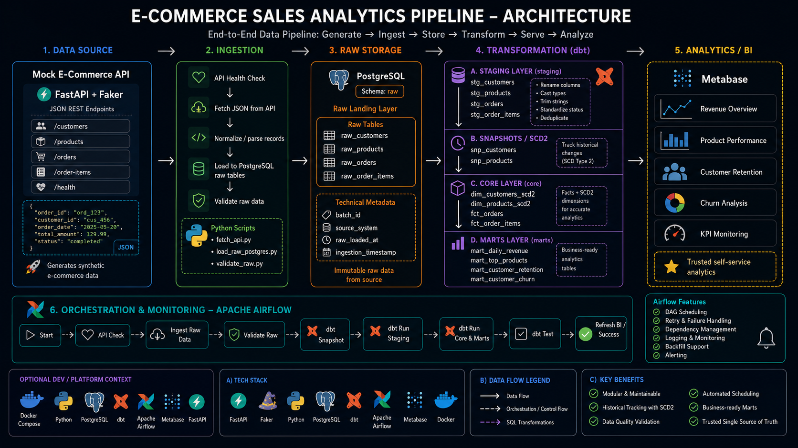

# 🏗️ E-Commerce Sales Analytics Pipeline

An end-to-end data engineering capstone project that generates synthetic e-commerce data from a Mock API, ingests it into PostgreSQL raw tables, transforms it with dbt across staging, snapshots, core, and marts layers, then serves business-ready analytics dashboards in Metabase.



---

## 🧾 Executive Summary (For Hiring Managers)

- ✅ **Pipeline scope:** Built an end-to-end e-commerce analytics pipeline from Mock API to PostgreSQL, dbt models, and BI-ready marts.
- ✅ **Source simulation:** Created a synthetic e-commerce API using FastAPI + Faker with JSON endpoints for customers, products, orders, and order items.
- ✅ **ETL development:** Implemented Python ingestion to fetch API data, normalize JSON records, and load PostgreSQL raw tables.
- ✅ **Transformation layer:** Structured dbt models across **staging → snapshots/SCD2 → core → marts** for clean and historical analytics modeling.
- ✅ **Analytics delivery:** Published business-ready marts for revenue, product performance, customer retention, and churn dashboards.

---

## 🧩 Problem & Context

The business needs a trusted analytics pipeline that can answer questions such as:

- revenue by day/month
- top products and categories
- new vs. returning customers
- customer retention and churn
- product and customer historical changes

**Challenge:** Raw API data is not ready for BI. It arrives as JSON, needs cleaning, deduplication, type casting, validation, and historical tracking for customer/product changes.

**Solution:** Mock API → PostgreSQL raw → dbt staging → dbt snapshots/SCD2 → dbt core → dbt marts → Metabase dashboard, orchestrated by Airflow. This creates a trusted source of truth for revenue, product performance, retention, and churn analytics.

---

## 🧰 Tech Stack

- ⚡ **API Source:** FastAPI + Faker for generating synthetic e-commerce JSON data.
- 🐍 **Language:** Python for API ingestion, raw loading, validation, configuration, and logging.
- 🐘 **Database / Warehouse:** PostgreSQL for raw tables, dbt models, snapshots, core, and marts.
- 🔧 **Transformation:** dbt + dbt-postgres for **staging → snapshots/SCD2 → core → marts** modeling.
- 🐳 **Development Environment:** Docker / Docker Compose for local services.
- 📊 **Dashboarding:** Metabase for revenue, product, retention, and churn dashboards.
- 🔄 **Orchestration:** Apache Airflow for scheduling, dependencies, retries, and monitoring.
- 📦 **Version Control:** Git / GitHub for source control and portfolio publishing.

---

## 🏗️ Pipeline Architecture


The project follows an end-to-end analytics pipeline pattern:

```text
Generate -> Ingest -> Store -> Transform -> Serve -> Analyze
```

### 1. Data Source - Mock E-Commerce API

The source system is a mock e-commerce API built with FastAPI + Faker.

API endpoints:

```text
GET /customers
GET /products
GET /orders
GET /order-items
GET /health
```

The API returns stable JSON records for customers, products, orders, and order_items. This simulates a real operational e-commerce system while keeping the project fully reproducible locally.

### 2. Ingestion Layer - Python ETL

Python scripts extract data from API endpoints and load the records into PostgreSQL raw tables.

Typical ingestion flow:

```text
API Health Check
  -> Fetch JSON from API
  -> Parse / normalize records
  -> Load into PostgreSQL raw tables
  -> Log row counts
  -> Validate raw data
```

### 3. Raw Storage - PostgreSQL Raw Layer

PostgreSQL stores raw API records in a dedicated raw schema.

Raw tables:

```text
raw_customers
raw_products
raw_orders
raw_order_items
```

Each raw table keeps source fields plus technical metadata such as ingested_at, batch_id, source_system, and raw_payload. The raw layer acts as the replayable landing zone and preserves source-like data before business logic is applied.

### 4. Transformation Layer - dbt

dbt transforms raw data into analytics-ready tables.

```text
raw -> staging -> snapshots / SCD2 -> core -> marts
```

#### A. Staging Layer

Staging models standardize raw source tables.

```text
stg_customers
stg_products
stg_orders
stg_order_items
```

#### B. Snapshots / SCD Type 2

dbt snapshots preserve historical changes for customer and product attributes.

```text
snp_customers
snp_products
```

#### C. Core Layer

The core layer contains stable fact and dimension models.

```text
dim_customers
dim_products
fct_orders
fct_order_items
```

Modeling logic:

- Dimensions are built from dbt snapshots.
- Facts are built from staging order and order-item data.
- Facts join to SCD2 dimensions using business key, event date, and valid-from / valid-to windows.

Recommended analytical grain:

- fct_orders: 1 row per order.
- fct_order_items: 1 row per order item.

This separation keeps order-level metrics and line-item-level product revenue analysis clean.

#### D. Marts Layer

The marts layer exposes business-ready tables for dashboards and stakeholder analysis.

```text
mart_daily_revenue
mart_top_products
mart_customer_retention
mart_customer_churn
```

### 5. Analytics / BI - Metabase

Metabase consumes the dbt marts and turns them into business dashboards.

Dashboard themes:

- **Mart Daily Revenue**

- **Mart Top Products**

- **Mart Customer Retention**

- **Mart Customer Churn**

### 6. Orchestration & Monitoring - Apache Airflow

Airflow coordinates the full pipeline as a scheduled DAG.

```text
Start
  -> API Check
  -> Ingest Raw Data
  -> Validate Raw
  -> dbt Snapshot
  -> dbt Run Staging
  -> dbt Run Core & Marts
  -> dbt Test
  -> Refresh BI / Success
```

Main orchestration file:

```text
airflow/dags/ecommerce_daily_pipeline.py
```

---

## 💻 Data Engineering Skills Demonstrated

### ETL / ELT Pipeline Development

- **API Ingestion:** Built Python scripts to fetch JSON data from FastAPI endpoints and load PostgreSQL raw tables.
- **Config & Logging:** Implemented reusable configuration and logging for pipeline execution.
- **Repeatable Loads:** Supported full-refresh / incremental-style raw loading with ingestion metadata.

### Data Modeling

- **Layered Modeling:** Structured dbt models across **staging → snapshots/SCD2 → core → marts**.
- **SCD Type 2:** Tracked historical changes for customers and products using dbt snapshots.
- **Fact & Dimension Design:** Built `fct_orders`, `fct_order_items`, `dim_customers`, and `dim_products`.

### Transformation & Quality

- **Staging Standardization:** Cleaned raw data with renaming, casting, trimming, status standardization, and deduplication.
- **dbt Testing:** Applied data quality checks for nulls, uniqueness, relationships, accepted values, and business rules.
- **Raw Validation:** Validated row counts, keys, dates, quantities, prices, and line amount logic before transformation.

### Orchestration & Analytics Delivery

- **Airflow DAG Design:** Orchestrated API check, ingestion, validation, dbt snapshot, dbt run, and dbt test.
- **BI Delivery:** Published marts for revenue, product performance, customer retention, and churn dashboards.
- **Portfolio-Ready Docs:** Documented architecture, data model, runbook, and README for project presentation.